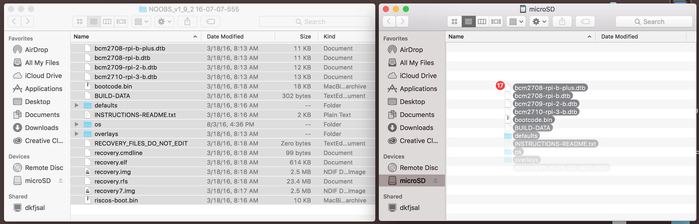
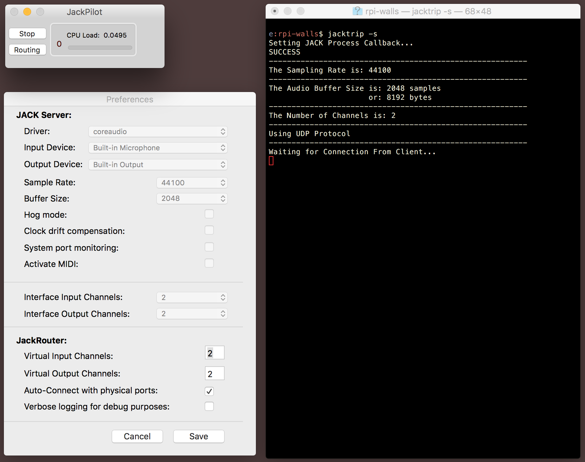

# rpi-sound-house
Work in progress for an installation at Automata, with John Eagle, Cassia Streb, and Janie Geiser.

This project sends audio using OSC packets to eight individual Raspberry Pis using the real-time audio programming language, [ChucK](http://chuck.cs.princeton.edu/). The following steps outline the process for setting up this system.

Install The Latest Raspbian (Jessie)
------------------------------------

While this isn't necessarily required for the ChucK implementation, it is definitely required for the JackTrip implementation. Go to the Raspberry Pi and get the latest [NOOBS image](https://www.raspberrypi.org/downloads/noobs/).

Format your microSD card using [SDFormatter](https://www.sdcard.org/downloads/formatter_4/).

Then simply load the contents of the NOOBS `.zip` onto your card.

Then load the microSD onto your Pi and install Raspbian using the prompts.

After the install, you might have to change your keyboard settings to US and use the system preferences to disable boot to desktop and enable boot to CLI (command-line interface).

To Enable WiFi on a Raspberry Pi And Set a Static IP
----------------------------------------------------

Use the following command to open the `wpa_supplicant.conf` with the built-in editor (Nano). A more detailed instruction of this process is found [here](https://www.raspberrypi.org/documentation/configuration/wireless/wireless-cli.md).

    sudo nano /etc/network/wpa_supplicant/wpa_supplicant.conf

Then add the following to the bottom of the file.

    network={
        ssid="your_network"
        psk="your_passkey"
    }

To save, press `ctrl-x`, when it asks to save, press `y`. Then press `enter` to finish.

On the Raspberry Pi 3, it's nice to turn off power management. This ensures that the WiFi still operates after 1 minute of inactivity. You'll have to the following line to your your `/etc/network/interfaces` config file.

    post-up iw dev $IFACE set power_save off

To access the file, type in `sudo nano /etc/network/interfaces`, and add the line right underneath the `iface wlan0 inet manual` line. It should look like the following.

    allow-hotplug wlan0
    iface wlan0 inet manual
        post-up iw dev $IFACE set power_save off
        wpa-conf /etc/wpa_supplicant/wpa_supplicant.conf

Now to set a static IP, we'll have to edit the `/etc/dhcpcd.conf` file, but first we'll need to know the router's IP address. To find it, type in `netstat -nr`, the router's IP will be listed under `Gateway`, it should look something like the following.

    Destination     Gateway         Genmask         Flag    MSS Window  irtt Iface
    0.0.0.0         192.168.X.X     0.0.0.0         UG      0 0         0 wlan0
    192.168.1.0     0.0.0.0         255.255.255.0   U       0 0         0 wlan0

Then type on `sudo nano /etc/dhcpcd.conf` to edit the `dhcpdc.conf` file, at the bottom, add the following.

    interface wlan0

    static ip_address=192.168.1.11/24       #put your desired IP address here, with the /24 after it
    static routers=192.168.X.X              #put your router's IP address here, in place of the 192.168.X.X
    static domain_name_servers=192.168.X.X  #same IP address as the above line

Reboot and make sure that your IP is to what you set it, and you're still on the network, then you should be good to go.

For the installation, `pione` will be `192.168.1.11`, `pitwo` will be `192.168.1.12`, and so on.

ChucK Implementation
--------------------
--------------------

Install ChucK on a Raspberry Pi
----------------------------------

First we'll have to install some depnedencies.

    sudo apt-get install bison flex
    sudo apt-get install alsa-base libasound2-dev libsndfile1-dev

Clone the ChucK repository to a suitable directory.

    git clone https://github.com/ccrma/chuck

Now we can change to the `chuck/src` directory and build the makefile.

    cd chuck/src
    make linux-alsa

After it is built, install it.

    sudo make install linux-alsa

Instructions
------------

On the Raspberry Pi, run the program that receives the OSX.

    chuck receiver.ck

And then on the master computer, run the program that sends the audio. You'll probably have to edit the file so you're sending to the proper IP addresses.

    chuck sender.ck

That's about it! It's not the best quality at the moment, will need to test with a dedicated router and tweak a few other things.

JACK/JackTrip Implementation
----------------------------
----------------------------

This was an attempt at not using OSC, and has since been disregarded. It might work well with a wired connection, but as it says in its documentation, JackTrip is not meant for wireless communication.

Mac OSC Install
---------------

Install JACK for OSX using this [`.zip`](https://dl.dropboxusercontent.com/u/28869550/JackOSX.0.92_b3.zip).

Then to install JackTrip, go here and download it's [`.zip`](https://github.com/jcacerec/jacktrip/releases).

After unzipping the `.zip` file, go to terminal, change to the directory where `jacktrip` is, go to `/bin`, and run the following commands.

    sudo cp jacktrip /usr/bin/
    sudo chmod 755 /usr/bin/jacktrip

If you're on El Capitan, Apple's System Integrity Protection will prevent you from moving anything around in root. To get around this you'll have to reboot, hold `cmd-r`, open up Terminal through utilities, and type in the following.

    csrutil disable
    reboot

Raspberry Pi (Linux) Install
----------------------------

The Jack audio server comes preinstalled on this version of Raspbian (maybe on others too), now we just have to install JackTrip.

    sudo apt-get install jacktrip

Setting Up a Server on OSX
--------------------------

Open up the `jackPilot` application, and open up it's preferences.

Make sure that Jack's settings matching the settings that we'll use on the Pi.

The only only you should have to change is the buffer size, which we'll set to `2048`.

Setting Up a Client on a Pi
--------------------------

Some of these directions for the initial setup come from [here](http://wiki.sgmk-ssam.ch/wiki/Raspberry_Pi).

First we have to run the JACK audio server, which we'll run in the in the background with the following.

    jackd -S -P70 -t2000 -dalsa -dhw:ALSA -r44100 -p2048 -n3 -s &

And then we start JackTrip talking to the OSX machine using the computer's IP.

    jacktrip -c 192.168.1.XXX

And we're off! The quality is decent enough for now, we'll keep tweaking options to improve it.~~
